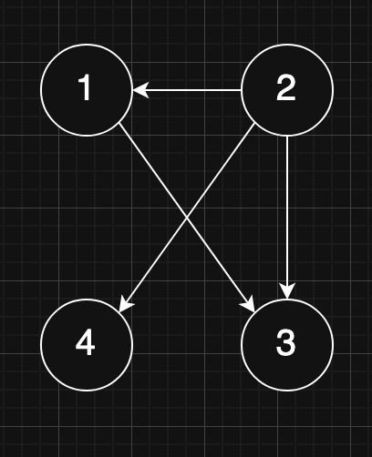

# Breadth First Search
Alla fine della ricerca, troveremo le **distanze minime** a tutti i vertici raggiungibili da `s`.

<font color="orange">**Attenzione:**</font> i nodi non raggiungibili da `s` **NON** vengono visitati! Non è detto che venga visitato tutto il grafo!

Il BFS tiene traccia di varie **informazioni sui vertici** (per ogni nodo `V`):
- La **distanza** dal vertice iniziale, che viene inizializzata ad $\infty$;
- Il **colore**, che viene inizializzato a **bianco**. Ci sono tre colori possibili, che rappresentano i seguenti stati:
  - **Visitato** (bianco)
  - **Visitato, ma non analizzato** (grigio)
  - **Visitato ed analizzato** (nero)
- Il **parent**, ovvero il nodo tramite cui sono arrivato a `V`.

**Algoritmo:**
- Inizializzazione:
  - Creo una **coda** in cui inserire i vertici;
  - Inizializzo tutte le distanze a $\infty$;
  - Inizializzo tutti i colori a bianco;
  - Inizializzo tutti i parent a null;
  - Imposto il colore **del nodo di partenza** a **grigio**, la **distanza** a 0 ed il **parent** a null;
  - Visito i nodi **direttamente connessi** al nodo di partenza, e li inserisco in coda. Imposto la loro distanza a 1 (**distanza del nodo di partenza + 1**), il **colore a grigio**, ed il **parent al nodo di partenza**. Ora posso impostare il colore del nodo di partenza a **nero**.
- Loop:
  - Finchè la coda non è vuota, estraggo un vertice e ripeto il procedimento: né imposto il colore a **nero**, imposto **colore**, **parent** e **distanza** dei **vertici bianchi adiacenti** opportunamente e li **inserisco in coda**.
  - Finisco quando **tutti i vertici hanno colore nero**.

```cs
// Qui g è una lista di adiacenza
void bfs(graph g, node s) {
    // Coda di appoggio, riempita di nodi grigi
    queue q;

    // Inizializzazione dei vertici
    foreach (node v in g) {
        color(v) = WHITE;
        distance(v) = INFINITY;
        parent(v) = null;
    }

    // Preparo il vertice di partenza
    color(s) = GRAY;
    distance(s) = 0;

    // E lo metto in coda
    enqueue(q, s);

    while (!queue_empty(q)) {
        // Estraggo un vertice dalla coda per elaborarlo
        node i = dequeue(q);

        // Guardo tutti i nodi adiacenti ad i **bianchi**
        foreach (node v in adjacent(i)) {
            if (color(v) == WHITE) {
                // Imposto le proprietà (distanza, colore, parent)
                distance(v) = distance(i) + 1;
                color(v) = GRAY;
                parent(v) = i;

                // Metto il nodo in coda
                enqueue(q, v);
            }
        }

        // Ho finito di elaborare il vertice, imposto il suo colore su nero
        color(i) = BLACK;
    }
}
```

**Tempo di esecuzione:**
- Caso migliore (`s` è isolato): $\Omega(|V|)$, dove $|V|$ è il numero di vertici nel grafo, in quanto devo comunque inizializzare tutti i vertici.
- Caso peggiore (`s` è connesso a tutti i vertici): $O(|V| + |E|)$, dove $|E|$ è il numero di lati.

# Depth First Search
Il DFS tiene traccia delle seguenti informazioni, per ogni vertice `v`:
- **Discovery time**: il "tempo" in cui il vertice viene inizialmente vistato;
- **Finish time**: il "tempo" in cui il vertice viene pienamente esplorato, inclusi i suoi nodi adiacenti;
- **Colore** e **parent**, come per la BFS.

Come struttura di appoggio utilizzo una **pila**, invece che una **coda**. Alternativamente posso scrivere l'algoritmo in modo **ricorsivo**.

Il DFS ci permette di isolare le **componenti connesse del grafo**, e ottenerne una lista dei vertici contenuti.

In un **grafo orientato**, possiamo fare delle ulteriori considerazioni grazie al **teorema delle parentesi**: i **rapporti** tra i tempi di inizio e fine visita tra due nodi sono sempre o **inclusi** o **slegati** l'uno dall'altro, e mai **"accavallati"**:

<br>

Questo ci permette di **etichettare ogni arco** come:
- **Tree-edge:** un arco che permette di trovare un nodo nuovo, ovvero un **vertice bianco**;
- **Back-edge:** un arco verso un **vertice grigio**, andando a formare un **ciclo**;
- **Forward-edge:** un arco verso un **vertice nero** i cui tempi sono inclusi in quelli del primo nodo;
- **Cross-edge:** un arco verso un **vertice nero** i cui tempi **NON** sono inclusi in quelli del primo nodo;

```cs
void dfs_visit(graph g, node u, out int time) {
    // Preparo il vertice, ed incremento il tempo globale
    // Imposto anche il suo discovery time
    color(u) = GRAY;
    discovery(u) = ++time;

    // Per ogni nodo *bianco* adiacente a U
    foreach (node v in adjacent(u)) {
        if (color(v) == WHITE) {
            parent(v) = u;
            dfs_visit(g, v, out time);
        }
    }

    // Ora che ho visitato completamente U,
    // imposto il suo finish time.
    finish(u) = ++time;
    color(u) = BLACK;
}

// La DFS è relativa a tutto il grafo, non ha un vertice di partenza
void dfs(graph g) {
    // Inizializzazione
    foreach (node v in g) {
        // Ho ancora il colore e il parent
        color(v) = WHITE;
        parent(v) = null;
    }

    // Tempo globale
    int time = 0;
    foreach (node v in g) {
        // Faccio la visita vera e propria per ogni nodo bianco
        if (color(v) == WHITE) {
            dfs_visit(g, v, out time);
        }
    }
}
```

**Tempo di esecuzione:**
- Caso generale: $\Theta(|V| + |E|) \approx \Theta(|V|)^2$, dato che analizzo sempre tutti i vertici una sola volta, scorrendo le liste di adiacenza.

# Ordinamento topologico
Uno degli usi dell'algoritmo DFS è l'**ordinamento topologico**.
Immaginiamo di avere un grafo orientato del genere:<br>



Dobbiamo definire un **ordine di nodi** che rispetti la proprietà di **precedenza** tra i vertici. Ad esempio:
- 2, 1, 3, 4
- 2, 1, 4, 3
- 2, 4, 1, 3

Questi sono **ordinamenti topologici**: non sono univoci, ma mantengono le precedenze.

Possiamo usare la DFS per trovare gli ordinamenti topologici di un grafo **aciclico** in base ai tempi di scoperta: ordinando i tempi di fine visita (in questo caso **8, 7, 4, 3**), e osservando i relativi tempi di inizio visita, ottengo **2, 4, 1, 3**, che come abbiamo già visto è un ordinamento topologico del grafo indicato.

# DFS per trovare le componenti connesse
```cs
foreach (node v in g) {
    // Faccio la visita vera e propria per ogni nodo bianco
    if (color(v) == WHITE) {
        dfs_visit(g, v, out time);
        // Qui ho trovato una componente connessa!
        // Appena vado al prossimo loop, e trovo
        // un vertice bianco, trovo l'inizio
        // di una nuova componente.
        connesse++;
    }
}
```

# Esercizi in esame
- Dato un grafo, scriverne la lista/matrice di adiacenza;
- Data una lista/matrice di adiacenza, costriurne il grafo ed eseguirne la DFS, specificando tempi di scoperta/fine, colori e parent passo per passo.
- Data una lista/matrice di adiacenza, costriurne il grafo ed eseguirne la BFS, specificando colori, parent e distanze passo per passo.

